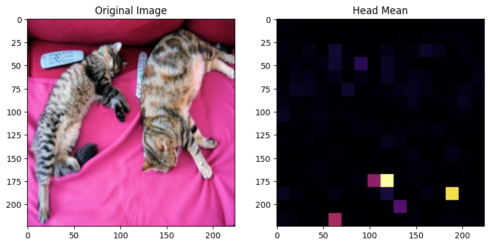
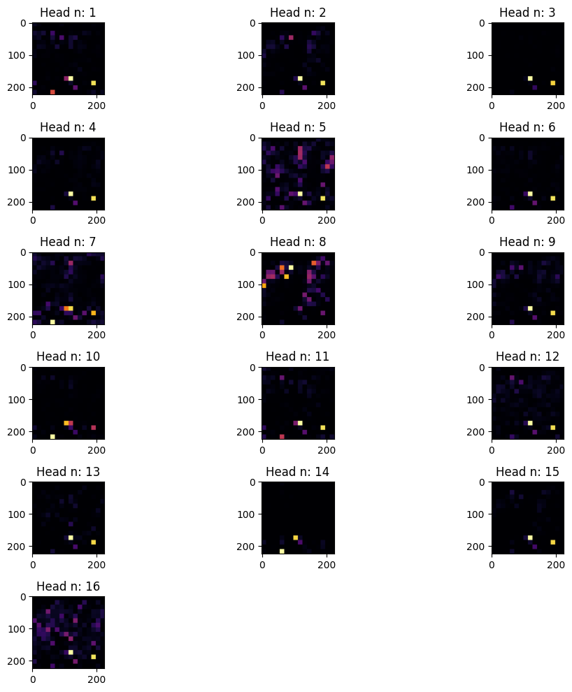
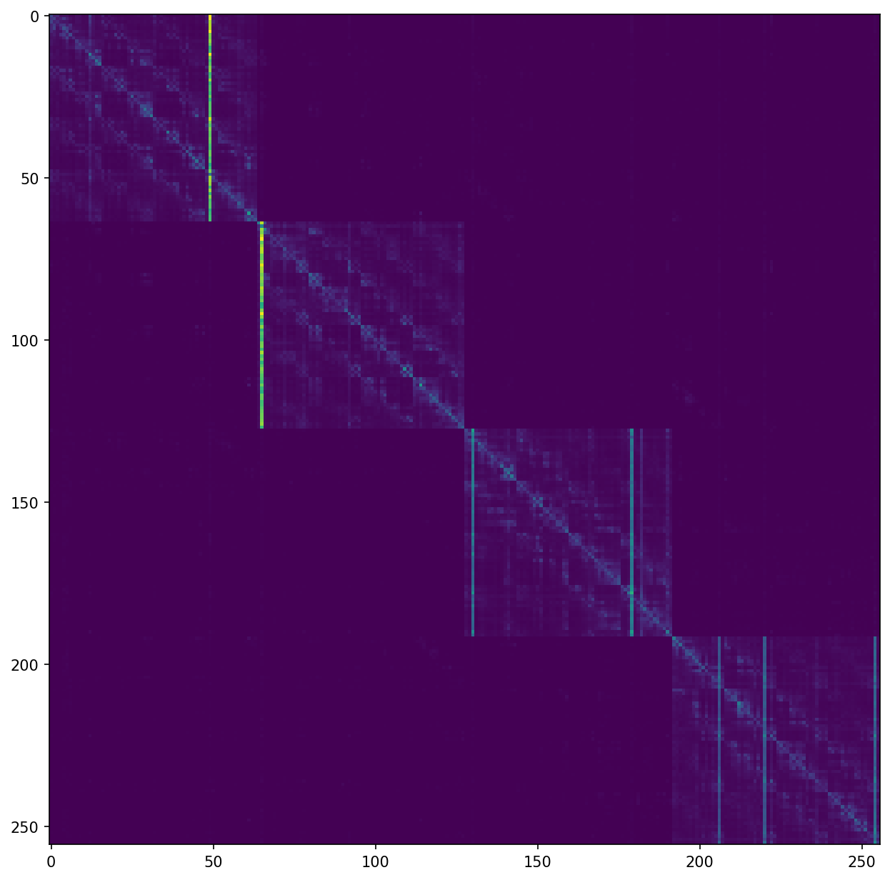

# 基于pytorch的vision transformer实现

## 参考源码

- vit-pytorch： https://github.com/lucidrains/vit-pytorch.git  

- visualize： https://ai.plainenglish.io/visualizing-attention-in-vision-transformer-c871908d86de

## 结构说明

- vit.py： vit的人工实现.
- demo.ipynb： 对人工实现的vit的可视化demo.
- demo_clip-vit.py： 对开源openai/clip-vit-large-patch14的模型进行注意力提取.
- clip-vit-visualize.ipynb： 实现对clip模型的注意力可视化.
- visualize.py： 参考可视化.
- reference.ipynb： 对比结果.
- qwen2.5vl.ipynb、qwen2.5vlpy： Qwen2.5vl的visual、language部分的注意力可视化
- qwen2.5vl_follow.ipynb： qwen2.5vl的visual-attentions矩阵生成.

## 日志

- 2025-7.19, 实现openai/clip-vit-large-patch14的vision部分注意力可视化.
  
  
  

- 2025-7.20，兼容实现qwen2.5vl的language-model部分的注意力可视化，效果不好，可能是因为最后的meger layer不是类似卷积那样的2x2合并，而是顺序4个合并image token.

- 2025-7.21，对注意力的插值方法改进，美化可视化的效果，实现qwen2.5vl的visual-model部分的注意力矩阵生成.
  


## 问题

- [x] 目前的注意力可视化代码过于粗糙，效果不好看.
- [ ] qwen2.5vl的language-model的注意力看不出效果.

## 收获

### 一、对开源大模型的源码阅读

在尝试对开源多模态大模型进行注意力提取及可视化过程中，增强了对Transformers库的源码结构的理解.

如阅读了openai/clip-vit-large-patch14的CLIPModel源码，其中的forward如下，知道了如何提取attentions

```py
def forward(
        self,
        input_ids: Optional[torch.LongTensor] = None,
        pixel_values: Optional[torch.FloatTensor] = None,
        attention_mask: Optional[torch.Tensor] = None,
        position_ids: Optional[torch.LongTensor] = None,
        return_loss: Optional[bool] = None,
        output_attentions: Optional[bool] = None,
        output_hidden_states: Optional[bool] = None,
        interpolate_pos_encoding: bool = False,
    ) -> CLIPOutput:
```

